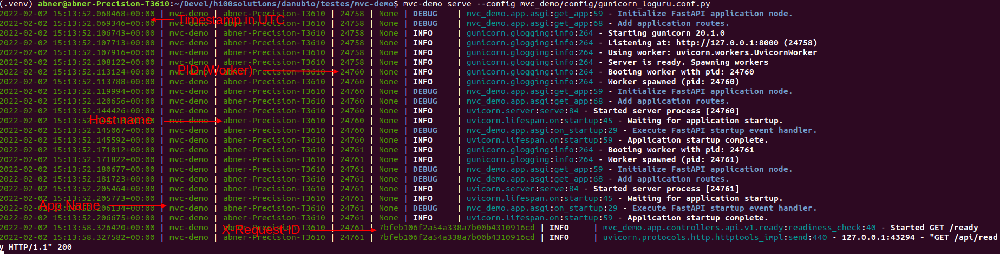

# mvc-demo
[](https://your.repo.url.here/actions/workflows/main.yml)
[](https://your.repo.url.here/actions/workflows/integration.yml)
[](https://github.com/psf/black)


## This project was generated with [fastapi-mvc](https://github.com/rszamszur/fastapi-mvc)

This project is a demonstration of a project generated with FASTAPI-MVC. The generated application has been modified to have the following characteristics:

1. Use [Loguru](https://github.com/Delgan/loguru) instead of the standard Python logging module.
2. That the logs generated by both Gunicorn and the application had the same format and were controlled by Loguru.
3. Safe operation of the logging system with async (Gunicorn/Uvicorn) and with threads/multiprocessing (Gunicorn), even logging to file.
4. Generate an X-Request-ID for each request received in Fastapi. This was done with middleware created with [asgi-correlation-id](https://github.com/snok/asgi-correlation-id).
5. Have a development environment where the application server does a hot reload when the source changes.

Below an example of the log generate by the application:



---

## How this was implemented

### 1. Loguru logging

Added these files:

#### [gunicorn_loguru.conf.py](mvc_demo/config/gunicorn_loguru.conf.py)

This is an custom config for Gunicorn to use a custom Logger class. The relevant change is:

```python
logger_class  = "mvc_demo.core.loguru_logs.StubbedGunicornLogger"
```

#### [loguru_logs.py](mvc_demo/core/loguru_logs.py)

This file instructs Gunicorn to use a custom Logger class. In this file are the Gunicorn custom Logger class StubbedGunicornLogger and all code needed to configure Loguru to intercept Gunicor/Uvicorn logs and to create an custom log format for the app.

The relevant change is:

* Get extra info to use in the log format
```python
def set_log_extras(record):
    record["extra"]["datetime"] = datetime.now(timezone.utc)   # Log datetime in UTC time zone, even if server is using another timezone
    record["extra"]["host"] = os.getenv('HOSTNAME', os.getenv('COMPUTERNAME', platform.node())).split('.')[0]
    record["extra"]["pid"] = os.getpid()
    record["extra"]["request_id"] = correlation_id.get()
    record["extra"]["app_name"] = settings.PROJECT_NAME
```
*Note: correlation_id.get() is from the `asgi-correlation-id` middleware.*
* Define the format of log lines
```python
def format_record(record: dict) -> str:
    ...
    format_string = "<green>{extra[datetime]}</green> | <green>{extra[app_name]}</green> | <green>{extra[host]}</green> | <green>{extra[pid]}</green> | <green>{extra[request_id]}</green> | <level>{level: <8}</level> | <cyan>{name}</cyan>:<cyan>{function}</cyan>:<cyan>{line}</cyan> - <level>{message}</level>"
    ...
```

* Define the format of log lines
```python
def format_record(record: dict) -> str:
    ...
    format_string = "<green>{extra[datetime]}</green> | <green>{extra[app_name]}</green> | <green>{extra[host]}</green> | <green>{extra[pid]}</green> | <green>{extra[request_id]}</green> | <level>{level: <8}</level> | <cyan>{name}</cyan>:<cyan>{function}</cyan>:<cyan>{line}</cyan> - <level>{message}</level>"
    ...
```

* Use Loguru enqueue to work smoothless with async/threads/multiprocessing
```python
def global_log_config(log_level: Union[str, int] = logging.INFO, json: bool = True):
    ...
    else:
        logger.configure(
            handlers=[
                {
                    "sink": stdout,
                    # https://loguru.readthedocs.io/en/stable/api/logger.html#sink
                    # "sink": "./somefile.log",
                    # "rotation": "10 MB",
                    "serialize": False,
                    # "format": "<green>{extra[datetime]}</green> | <green>{extra[correlation_id]}</green> | <green>{extra[request_id]}</green> | <level>{level: <8}</level> | <cyan>{name}</cyan>:<cyan>{function}</cyan>:<cyan>{line}</cyan> - <level>{message}</level>",
                    "format": format_record,
                    "diagnose": True,
                    "backtrace": True,
                    "enqueue": True,
                }
            ]
        )
    ...
```

and changed:

#### [asgi.py](mvc_demo/app/asgi.py) to use loguru instead of default logging:

```python
...
from mvc_demo.core.loguru_logs import global_log_config

global_log_config(
    log_level=logging.getLevelName(settings.LOG_LEVEL),
    json=settings.JSON_LOGS,
)

log = logger
...
```

### 2. X-Request-ID middleware

changed:

#### [asgi.py](mvc_demo/app/asgi.py) to use loguru instead of default logging:

```python
...

    # Register middlewares
    app.add_middleware(CorrelationIdMiddleware, header_name='X-Request-ID')

...
```

### 3. Local development server with hot reload on source changes

Added this file:

#### [wsgi_uvicorn.py](mvc_demo/wsgi_uvicorn.py)

This is an custom module to start a development Uvicorn server for the app with reload enabled.

and changed:

#### [pyproject.toml](pyproject.toml) to add an command to start Uvicorn wsgi server:

```
...
[tool.poetry.scripts]
mvc-demo = 'mvc_demo.cli.cli:cli'
mvc-demo-dev = 'mvc_demo.wsgi_uvicorn:run_dev_wsgi'
...
```

## Quickstart
First run `poetry install` in project root directory to install all dependencies.
```sh
$ poetry install
$ poetry shell
$ mvc-demo serve --config mvc_demo/config/gunicorn_loguru.conf.py
```
*Note: this process may take a while on first run.*

### To run app with Gunicorn (without reload on code changes)

```sh
$ mvc-demo serve --config mvc_demo/config/gunicorn_loguru.conf.py
```

### To run app with Uvicorn (with hot reload on code changes)

```sh
$ mvc-demo-dev
```

## Prerequisites

If You want to go easy way and use provided virtualized environment You'll need to have installed:
* Python >= 3.9 
* Poetry

Otherwise, for local complete project environment with k8s infrastructure bootstrapping You'll need to follow these instructions: [fastapi-mvc](https://github.com/rszamszur/fastapi-mvc)

For application:
* Python 3.9 or later installed [How to install python](https://docs.python-guide.org/starting/installation/)
* Poetry [How to install poetry](https://python-poetry.org/docs/#installation)

## Installation

With make:
```shell
make install
```

You can customize poetry installation with [environment variables](https://python-poetry.org/docs/configuration/#using-environment-variables) 
```shell
export POETRY_HOME=/custom/poetry/path
export POETRY_CACHE_DIR=/custom/poetry/path/cache
export POETRY_VIRTUALENVS_IN_PROJECT=true
make install
```

Or using poetry directly:
```shell
poetry install
```

## CLI

This package exposes simple CLI for easier interaction:

```shell
$ mvc-demo --help
Usage: mvc-demo [OPTIONS] COMMAND [ARGS]...

  mvc-demo CLI root.

Options:
  -v, --verbose  Enable verbose logging.
  --help         Show this message and exit.

Commands:
  serve  mvc-demo CLI serve command.
$ mvc-demo serve --help
Usage: mvc-demo serve [OPTIONS]

  mvc-demo CLI serve command.

Options:
  --host TEXT                  Host to bind.  [default: 127.0.0.1]
  -p, --port INTEGER           Port to bind.  [default: 8000]
  -w, --workers INTEGER RANGE  The number of worker processes for handling
                               requests.  [default: 2]

  -D, --daemon                 Daemonize the Gunicorn process.
  -e, --env TEXT               Set environment variables in the execution
                               environment.

  -c, --config PATH            Uses a custom gunicorn.conf.py configuration
  --pid PATH                   Specifies the PID file.
  --help                       Show this message and exit.
```

*NOTE: Maximum number of workers may be different in your case, it's limited to `multiprocessing.cpu_count()`*

To serve application simply run:

```shell
$ mvc-demo serve
```

To confirm it's working:

```shell
$ curl localhost:8000/api/ready
{"status":"ok"}
```

## Dockerfile

This repository provides Dockerfile for virtualized environment.

*NOTE: Replace podman with docker if it's yours containerization engine.*
```shell
$ make image
$ podman run -dit --name mvc-demo -p 8000:8000 mvc-demo:$(cat TAG)
f41e5fa7ffd512aea8f1aad1c12157bf1e66f961aeb707f51993e9ac343f7a4b
$ podman ps
CONTAINER ID  IMAGE                                 COMMAND               CREATED        STATUS            PORTS                   NAMES
f41e5fa7ffd5  localhost/mvc-demo:0.1.0  /usr/bin/fastapi ...  2 seconds ago  Up 3 seconds ago  0.0.0.0:8000->8000/tcp  mvc-demo
$ curl localhost:8000/api/ready
{"status":"ok"}
```

## Application configuration

This application provides flexibility of configuration. 
All significant settings are defined by the environment variables, each with the default value. 
Moreover, package CLI allows overriding core ones: host, port, workers. 
You can modify all other available configuration settings in the gunicorn.conf.py file.

Priority of overriding configuration:
1. cli
2. environment variables
3. gunicorn.conf.py

All application configuration is available in `mvc_demo.config` submodule.

### Environment variables

#### Application configuration

| Key                  | Default                                                         | Description                                                    |
|----------------------|-----------------------------------------------------------------|----------------------------------------------------------------|
| FASTAPI_HOST         | `"127.0.0.1"`                                                   | FastAPI host to bind.                                          |
| FASTAPI_PORT         | `"8000"`                                                        | FastAPI port to bind.                                          |
| FASTAPI_WORKERS      | `"2"`                                                           | Number of gunicorn workers (uvicorn.workers.UvicornWorker)     |
| FASTAPI_DEBUG        | `"True"`                                                        | FastAPI logging level. You should disable this for production. |
| FASTAPI_PROJECT_NAME | `"mvc-demo"`                               | FastAPI project name.                                          |
| FASTAPI_VERSION      | `"0.4.0"`                                                       | Application version.                                           |
| FASTAPI_DOCS_URL     | `"/"`                                                           | Path where swagger ui will be served at.                       |
| FASTAPI_USE_REDIS    | `"False"`                                                       | Whether or not to use Redis.                                   |
| FASTAPI_GUNICORN_LOG_LEVEL | `"info"`                                                        | The granularity of gunicorn log output |
| FASTAPI_GUNICORN_LOG_FORMAT | `'%(h)s %(l)s %(u)s %(t)s "%(r)s" %(s)s %(b)s "%(f)s" "%(a)s"'` | Gunicorn log format |

#### Redis configuration

| Key                        | Default       | Description                               |
|----------------------------|---------------|-------------------------------------------|
| FASTAPI_REDIS_HOTS         | `"127.0.0.1"` | Redis host.                               |
| FASTAPI_REDIS_PORT         | `"6379"`      | Redis port.                               |
| FASTAPI_REDIS_USERNAME     | `""`          | Redis username.                           |
| FASTAPI_REDIS_PASSWORD     | `""`          | Redis password.                           |
| FASTAPI_REDIS_USE_SENTINEL | `"False"`     | If provided Redis config is for Sentinel. |

### gunicorn.conf.py

1. Source: `mvc_demo.config/gunicorn.conf.py`
2. [Gunicorn configuration file documentation](https://docs.gunicorn.org/en/latest/settings.html)

### Routes definition

Endpoints are defined in `mvc_demo.config.router`. Just simply import your controller and include it to FastAPI router:

```python
from fastapi import APIRouter
from mvc_demo.app.controllers.api.v1 import ready

router = APIRouter(
    prefix="/api"
)

router.include_router(ready.router, tags=["ready"])
```

## Development

You can implement your own web routes logic straight away in `mvc_demo.app.controllers.api.v1` submodule. For more information please see [FastAPI documentation](https://fastapi.tiangolo.com/tutorial/).

### Utilities

For your discretion, I've provided some basic utilities:
* RedisClient `mvc_demo.app.utils.redis`
* AiohttpClient `mvc_demo.app.utils.aiohttp_client`

They're initialized in `asgi.py` on FastAPI startup event handler:

```python
async def on_startup():
    """Fastapi startup event handler.

    Creates RedisClient and AiohttpClient session.

    """
    log.debug("Execute FastAPI startup event handler.")
    # Initialize utilities for whole FastAPI application without passing object
    # instances within the logic. Feel free to disable it if you don't need it.
    if settings.USE_REDIS:
        await RedisClient.open_redis_client()

    AiohttpClient.get_aiohttp_client()


async def on_shutdown():
    """Fastapi shutdown event handler.

    Destroys RedisClient and AiohttpClient session.

    """
    log.debug("Execute FastAPI shutdown event handler.")
    # Gracefully close utilities.
    if settings.USE_REDIS:
        await RedisClient.close_redis_client()

    await AiohttpClient.close_aiohttp_client()
```

and are available for whole application scope without passing object instances. In order to utilize it just execute classmethods directly.

Example:
```python
from mvc_demo.app.utils import RedisClient

response = RedisClient.get("Key")
```
```python
from mvc_demo.app.utils import AiohttpClient

response = AiohttpClient.get("http://foo.bar")
```

### Exceptions

#### HTTPException and handler

Source: `mvc_demo.app.exceptions.http.py`

This exception combined with `http_exception_handler` method allows you to use it the same manner as you'd use `FastAPI.HTTPException` with one difference. 
You have freedom to define returned response body, whereas in `FastAPI.HTTPException` content is returned under "detail" JSON key.
In this application custom handler is added in `asgi.py` while initializing FastAPI application. 
This is needed in order to handle it globally.

### Web Routes
All routes documentation is available on:
* `/` with Swagger
* `/redoc` or ReDoc.

## License

This project is licensed under the terms of the MIT license.

## Credits

* https://github.com/rszamszur/fastapi-mvc
* https://pawamoy.github.io/posts/unify-logging-for-a-gunicorn-uvicorn-app/
* https://github.com/pahntanapat/Unified-FastAPI-Gunicorn-Log
* https://github.com/Delgan/loguru/issues/365
* https://loguru.readthedocs.io/en/stable/api/logger.html#sink
* https://github.com/snok/asgi-correlation-id


